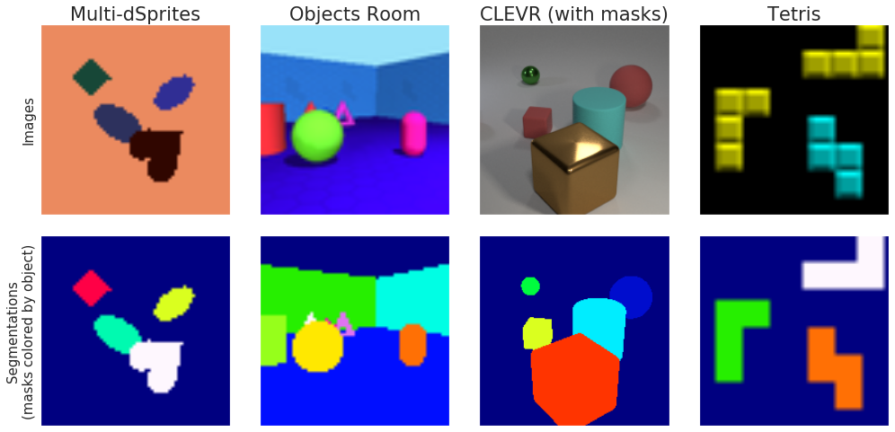

# Multi-Object Datasets

This repository contains datasets for multi-object representation learning, used
in developing scene decomposition methods like
[MONet](https://arxiv.org/abs/1901.11390) [1] and
[IODINE](http://proceedings.mlr.press/v97/greff19a.html) [2]. The datasets we
provide are:

1.  [Multi-dSprites](#multi-dsprites)
2.  [Objects Room](#objects-room)
3.  [CLEVR (with masks)](#clevr-with-masks)
4.  [Tetrominoes](#tetrominoes)



The datasets consist of multi-object scenes. Each image is accompanied by
ground-truth segmentation masks for all objects in the scene. We also provide
per-object generative factors (except in Objects Room) to facilitate
representation learning. The generative factors include all necessary and
sufficient features (size, color, position, etc.) to describe and render the
objects present in a scene.

Lastly, the `segmentation_metrics` module contains a TensorFlow implementation
of the
[adjusted Rand index](https://en.wikipedia.org/wiki/Rand_index#Adjusted_Rand_index)
[3], which can be used to compare inferred object segmentations with
ground-truth segmentation masks. All code has been tested to work with
TensorFlow r1.14.

## Bibtex

If you use one of these datasets in your work, please cite it as follows:

```
@misc{multiobjectdatasets19,
  title={Multi-Object Datasets},
  author={Kabra, Rishabh and Burgess, Chris and Matthey, Loic and
          Kaufman, Raphael Lopez and Greff, Klaus and Reynolds, Malcolm and
          Lerchner, Alexander},
  howpublished={https://github.com/deepmind/multi-object-datasets/},
  year={2019}
}
```

## Descriptions

### Multi-dSprites

This is a dataset based on
[dSprites](https://github.com/deepmind/dsprites-dataset). Each image consists of
multiple oval, heart, or square-shaped sprites (with some occlusions) set
against a uniformly colored background.

We're releasing three versions of this dataset containing 1M datapoints each:

1.1 Binarized: each image has 2-3 white sprites on a black background.

1.2 Colored sprites on grayscale: each scene has 2-5 randomly colored HSV
sprites on a randomly sampled grayscale background.

1.3 Colored sprites and background: each scene has 1-4 sprites. All colors are
randomly sampled RGB values.

Each datapoint contains an image, a number of background and object masks, and
the following ground-truth features per object: `x` and `y` positions, `shape`,
`color` (rgb values), `orientation`, and `scale`. Lastly, `visibility` is a
binary feature indicating which objects are not null.

### Objects Room

This dataset is based on the [MuJoCo](http://www.mujoco.org/) environment used
by the Generative Query Network [4] and is a multi-object extension of the
[3d-shapes dataset](https://github.com/deepmind/3d-shapes). The training set
contains 1M scenes with up to three objects. We also provide ~1K test examples
for the following variants:

2.1 Empty room: scenes consist of the sky, walls, and floor only.

2.2 Six objects: exactly 6 objects are visible in each image.

2.3 Identical color: 4-6 objects are placed in the room and have an identical,
randomly sampled color.

Datapoints consist of an image and fixed number of masks. The first four masks
correspond to the sky, floor, and two halves of the wall respectively. The
remaining masks correspond to the foreground objects.

### CLEVR (with masks)

We adapted the
[open-source script](https://github.com/facebookresearch/clevr-dataset-gen)
provided by Johnson et al. to produce ground-truth segmentation masks for CLEVR
[5] scenes. These were generated afresh, so images in this dataset are not
identical to those in the original CLEVR dataset. We ignore the original
question-answering task.

The images and masks in the dataset are of size 320x240. We also provide all
ground-truth factors included in the original dataset (namely `x`, `y`, and `z`
position, `pixel_coords`, and `rotation`, which are real-valued; plus `size`,
`material`, `shape`, and `color`, which are encoded as integers) along with a
`visibility` vector to indicate which objects are not null.

### Tetrominoes

This is a dataset of Tetris-like shapes (aka tetrominoes). Each 35x35 image
contains three tetrominoes, sampled from 17 unique shapes/orientations. Each
tetromino has one of six possible colors (red, green, blue, yellow, magenta,
cyan). We provide `x` and `y` position, `shape`, and `color` (integer-coded) as
ground-truth features. Datapoints also include a `visibility` vector.

## Download

The datasets can be downloaded from
[Google Cloud Storage](https://console.cloud.google.com/storage/browser/multi-object-datasets).
Each dataset is a single
[TFRecords](https://www.tensorflow.org/tutorials/load_data/tf_records) file. To
download a particular dataset, use the web interface, or run `wget` with the
appropriate filename as follows:

```shell
  wget https://storage.googleapis.com/multi-object-datasets/multi_dsprites/multi_dsprites_colored_on_colored.tfrecords
```

To download all datasets, you'll need the `gsutil` tool, which comes with the
[Google Cloud SDK](https://cloud.google.com/sdk/docs/). Simply run:

```shell
  gsutil cp -r gs://multi-object-datasets .
```

The approximate download sizes are:

1.  Multi-dSprites: between 500 MB and 1 GB.
2.  Objects Room: the training set is 7 GB. The test sets are 6-8 MB.
3.  CLEVR (with masks): 10.5 GB.
4.  Tetrominoes: 300 MB.

## Usage

After downloading the dataset files, you can read them as
[`tf.data.Dataset`](https://www.tensorflow.org/api_docs/python/tf/data/Dataset)
instances with the readers provided. The example below shows how to read the
colored-sprites-and-background version of Multi-dSprites:

```python
  import multi_dsprites
  import tensorflow as tf

  tf_records_path = 'path/to/multi_dsprites_colored_on_colored.tfrecords'
  batch_size = 32

  dataset = multi_dsprites.dataset(tf_records_path, 'colored_on_colored')
  batched_dataset = dataset.batch(batch_size)  # optional batching
  iterator = batched_dataset.make_one_shot_iterator()
  data = iterator.get_next()

  with tf.train.SingularMonitoredSession() as sess:
    d = sess.run(data)
```

All dataset readers return images and segmentation masks in the following
canonical format (assuming the dataset is batched as above):

-   'image': `Tensor` of shape [batch_size, height, width, channels] and type
    uint8.

-   'mask': `Tensor` of shape [batch_size, max_num_entities, height, width,
    channels] and type uint8. The tensor takes on values of 255 or 0, denoting
    whether a pixel belongs to a particular entity or not.

You can compare predicted object segmentation masks with the ground-truth masks
using `segmentation_metrics.adjusted_rand_index` as below:

```python
  max_num_entities = multi_dsprites.MAX_NUM_ENTITIES['colored_on_colored']
  # Ground-truth segmentation masks are always returned in the canonical
  # [batch_size, max_num_entities, height, width, channels] format. To use these
  # as an input for `segmentation_metrics.adjusted_rand_index`, we need them in
  # the [batch_size, n_points, n_true_groups] format,
  # where n_true_groups == max_num_entities. We implement this reshape below.
  # Note that 'oh' denotes 'one-hot'.
  desired_shape = [batch_size,
                   multi_dsprites.IMAGE_SIZE[0] * multi_dsprites.IMAGE_SIZE[1],
                   max_num_entities]
  true_groups_oh = tf.transpose(data['mask'], [0, 2, 3, 4, 1])
  true_groups_oh = tf.reshape(true_groups_oh, desired_shape)

  random_prediction = tf.random_uniform(desired_shape[:-1],
                                        minval=0, maxval=max_num_entities,
                                        dtype=tf.int32)
  random_prediction_oh = tf.one_hot(random_prediction, depth=max_num_entities)

  ari = segmentation_metrics.adjusted_rand_index(true_groups_oh,
                                                 random_prediction_oh)
```

To exclude all background pixels from the ARI score (as in [2]), you can compute
it as follows instead. This assumes the first true group contains all background
pixels:

```python
  ari_nobg = segmentation_metrics.adjusted_rand_index(true_groups_oh[..., 1:],
                                                      random_prediction_oh)
```

## References

[1] Burgess, C. P., Matthey, L., Watters, N., Kabra, R., Higgins, I., Botvinick,
M., & Lerchner, A. (2019). Monet: Unsupervised scene decomposition and
representation. arXiv preprint arXiv:1901.11390.

[2] Greff, K., Kaufman, R. L., Kabra, R., Watters, N., Burgess, C., Zoran, D.,
Matthey, L., Botvinick, M., & Lerchner, A. (2019). Multi-Object Representation
Learning with Iterative Variational Inference. Proceedings of the 36th
International Conference on Machine Learning, in PMLR 97:2424-2433.

[3] Rand, W. M. (1971). Objective criteria for the evaluation of clustering
methods. Journal of the American Statistical association, 66(336), 846-850.

[4] Eslami, S., Rezende, D. J., Besse, F., Viola, F., Morcos, A., Garnelo, M.,
Ruderman, A., Rusu, A., Danihelka, I., Gregor, K., Reichert, D., Buesing, L.,
Weber, T., Vinyals, O., Rosenbaum, D., Rabinowitz, N., King, H., Hillier, C.,
Botvinick, M., Wierstra, D., Kavukcuoglu, K., & Hassabis, D. (2018). Neural
scene representation and rendering. Science, 360(6394), 1204-1210.

[5] Johnson, J., Hariharan, B., van der Maaten, L., Fei-Fei, L., Lawrence
Zitnick, C., & Girshick, R. (2017). Clevr: A diagnostic dataset for
compositional language and elementary visual reasoning. In Proceedings of the
IEEE Conference on Computer Vision and Pattern Recognition (pp. 2901-2910).

## Disclaimers

This is not an official Google product.
